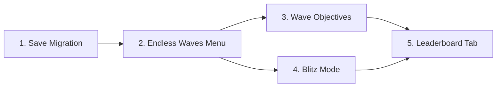

# Phase 1: Wave Objectives + Blitz Mode

## Status: ✅ COMPLETE (with tuning follow-up)

PRD for the first phase of Run Variety Expansion. Covers Wave Objectives (Survival feature), Blitz Mode (new endless mode), the Endless Waves hub menu, and related save/leaderboard changes.

Created: 2026-03-09
Last Updated: 2026-03-10

---

## Goal

Ship two high-impact, low-cost features that make ZepBall's endless modes feel distinct from one another and add replayability:

1. **Wave Objectives** — optional per-wave bonus challenges in Survival
2. **Blitz Mode** — a new "Tetris-pressure" endless mode where brick rows push toward the paddle on a timer

Both ship under a new **Endless Waves** hub menu that replaces the current Survival main-menu button and provides room for future endless modes.

Implementation should be executed as two deliverables under this single task:
- **Phase 1A:** Endless Waves hub + Survival Wave Objectives
- **Phase 1B:** Blitz mode + Blitz score persistence + Blitz leaderboard wiring

## Implementation Progress
- **2026-03-10:** Endless Waves hub menu scaffolded and wired.
- Main menu button now routes to the new Endless Waves scene.
- Survival card launches the existing Survival mode flow.
- Blitz card launches Blitz mode and now uses active (non-placeholder) button text/state.
- **2026-03-10:** Survival wave objective runtime integrated (assignment, progress tracking, completion/fail events, HUD updates, and score bonus award path).
- **2026-03-10:** Save/leaderboard groundwork for Blitz implemented.
- Added `blitz_top_runs` persistence and migration/sanitization paths.
- High Scores `BLITZ` tab now renders live run data (or empty state) instead of placeholder text.
- Added `SaveManager` Blitz APIs (`save_blitz_run`, `get_blitz_top_runs`, `set_last_played_blitz`) and menu/game-over wiring for Blitz run persistence.
- Added stats key/migration support for `blitz_games_played` and `wave_objectives_completed`; objective completion now increments the objective stat.
- **2026-03-10:** Blitz core gameplay loop implemented and enabled from Endless Waves hub.
- Added timed push system (`main_blitz_helper.gd`) with interval tightening toward a floor, row/score HUD status, and paddle-zone game-over checks.
- Added Blitz row generation APIs to `survival_generator.gd` (`generate_blitz_initial`, `generate_blitz_row`) with breakable-only row output.
- Main scene now routes Blitz runs through helper-owned setup/loop path and suppresses standard level-complete behavior in Blitz mode.
- Added pushed-brick overlap handling so a brick pushed into an existing ball position triggers contact/break behavior immediately.
- **2026-03-10:** Blitz polish pass completed.
- Pause menu mode detail now reports Blitz row context instead of legacy level labels.
- New Blitz spawn columns now anchor to the left wall boundary.
- Blitz push rows now sample the full playable vertical lane range (including top and bottom lanes).
- Push timer HUD now uses countdown color thresholds (green -> yellow -> red) without per-tick pulse.
- Clearing all bricks before the next push now grants an all-clear score bonus.
- All-clear bonus now shows a short in-run HUD callout in the combo overlay area.
- Exiting Survival/Blitz before game over now records the current score as a completed run.
- Remaining tuning follow-up is pacing/balance feel across longer play sessions and is tracked under `.agent/Tasks/Backlog/run-variety-expansion.md`.

---

## 1. Endless Waves Hub Menu

### What It Is
A selection screen that replaces the current "Survival" button on the main menu. Shows mode cards with titles, short descriptions, and best-run info — similar to the existing pack/mode selection UI.

### Modes at Launch
| Mode | Description |
|------|-------------|
| Survival | Wave-based endless mode. Clear each wave to advance. Speed increases over time. |
| Blitz | Bricks push toward the paddle on a timer. Clear them before they reach you. |

### Technical Changes

#### [MODIFY] `scripts/ui/main_menu.gd`
- Replace `_on_survival_button_pressed()` → `_on_endless_waves_pressed()` that routes to the new hub scene.

#### [MODIFY] `scripts/ui/menu_controller.gd`
- Add `show_endless_waves()` function (similar to `show_set_select()`).
- Add `start_blitz()` function (similar to `start_survival()`).
- Add `is_blitz_mode: bool` flag.
- Update `show_game_over()` to handle Blitz game-over alongside Survival.

#### [NEW] Endless Waves selection scene
- New `.tscn` + `.gd` in `scenes/ui/`.
- Mode cards with title, description, and best-run display.
- Back button returns to main menu.

#### [MODIFY] `scenes/ui/main_menu.tscn`
- Rename Survival button label to "Endless Waves" and rewire signal.

---

## 2. Wave Objectives (Survival)

### What It Is
Optional bonus challenges that appear on ~60-70% of Survival waves. A small HUD element shows the objective and reward. Completing it grants a bonus; failing it has no penalty. Scoped to Survival only for initial release — may expand to Blitz (with time-window-based objectives) in a future phase.

### Objective Pool

| Objective | Condition | Always valid? | Scales with wave? |
|-----------|-----------|---------------|-------------------|
| No Ball Loss | Don't lose the ball this wave | ✅ | No (naturally harder) |
| Speed Clear | Clear wave in under X seconds | ✅ | Yes — timer tightens, floor ~30s |
| Combo Streak | Reach Nx combo | ✅ | Yes — raise N, cap ~15 |
| Bomb Chain | Trigger N bomb explosions | ❌ Layout-check | Gentle — only if enough bombs |
| Spin Master | Land N high-spin brick hits (from paddle-imparted spin) | ✅ | Gentle — cap ~5 |
| Opening Salvo | Break N bricks in first 15 seconds | ✅ | Yes — raise N |

### Design Rules
- Objectives reward "played well," not "played perfectly." ~50-60% completion rate for a decent player.
- Power-up-dependent objectives are excluded (player can't control drops).
- Early waves (1-3) have higher objective odds to teach the mechanic.
- Reward types can scale: points early, extra lives deeper in runs.
- Objectives interact with existing combo/streak multiplier system — no conflict.
- Combo objectives are relative to current run state: target combo is computed as `current_combo + objective_delta` at wave assignment time.

### HUD
- Persistent top HUD element: `⭐ No ball loss | +500`
- Threshold objectives show live progress: `⭐ 10x Combo: 6/10 | +500`
- Timed objectives show live countdown: `⭐ Speed Clear < 48s | 31s LEFT | +500`
- Completion: brief flash + checkmark. Failure: fade/strikethrough quietly.
- No separate UI screen, no banner that fades — always visible.

### Technical Changes

#### [NEW] Wave Objective system (helper class)
- New `wave_objective_helper.gd` (or similar).
- `assign_objective(wave_data: Dictionary, wave_number: int) -> Dictionary` — inspects generated wave layout, picks a valid objective from the pool (or returns empty for "no objective" waves).
- `check_objective_progress(event_type, event_data)` — called on relevant events (ball lost, brick broken, combo changed, etc.).
- `is_objective_complete() -> bool` / `is_objective_failed() -> bool`.

#### [MODIFY] `scripts/main_survival_helper.gd`
- Own the objective lifecycle for Survival waves (assignment/reset/complete/fail).
- In `_load_survival_wave()`: trigger objective assignment after `generate_wave()`.
- In `_on_survival_wave_complete()`: check and award objective bonus before transitioning.

#### [MODIFY] `scripts/main.gd`
- Forward Survival gameplay events into the objective helper (ball loss, brick break, combo/streak updates, timed window checks).
- Keep objective logic mode-scoped to Survival; do not make `GameManager` the objective owner.

#### [MODIFY] `scripts/hud.gd`
- Wire objective updates into the existing objective HUD element from UI overhaul work.
- Connect to objective progress/completion/failure updates.

### Open Design Questions
- ~~Multi-ball edge case: does losing one of four balls fail "No Ball Loss"?~~ **Resolved: No.** Losing multi-ball clones does NOT fail the objective — only losing the primary/last ball counts. Penalizing multi-ball loss would discourage players from picking up Triple Ball, which is anti-fun.

---

## 3. Blitz Mode

### What It Is
A new endless mode where brick rows push in from the left edge on a fixed timer. Existing bricks shift one column rightward toward the paddle. Game over when any brick reaches the paddle zone after a push. No wave transitions — bricks from multiple generations coexist.

### Core Rules
- **No unbreakable bricks.** Push timer pressure is the difficulty lever.
- **Push direction**: left → right (toward the vertical paddle on the right side).
- **Push mechanic**: instant snap (no animation). If a brick snaps into the ball's position, the ball collides with the new brick.
- **Initial board**: 2-3 pre-placed rows so there's something to clear from the start.
- **Difficulty scaling**: `DifficultyManager` multipliers apply for speed and score (Easy 0.8x / Normal 1.0x / Hard 1.2x), same as all other modes.

### Push Timer Pacing
- Start: ~15-20 seconds between pushes.
- Tighten: ~1 second reduction every N pushes.
- Floor: ~8 seconds (never faster).
- Ball speed also ramps via existing `DifficultyManager` path.
- All values need longer-session playtesting — these are starting points and are tracked as ongoing tuning in `.agent/Tasks/Backlog/run-variety-expansion.md`.

### Game Over Condition
After each push, scan the rightmost column(s). If any brick occupies the paddle zone → game over.

### Score Tracking
- Score accumulates normally (breaking bricks with combo/streak/difficulty multipliers).
- Persist **score only** for leaderboards/save data.
- Rows survived can still be tracked for in-run UX and shown on game over, but are not persisted.

### Technical Changes

#### [NEW] Blitz generator function
- Add `generate_blitz_row(row_number: int, rng: RandomNumberGenerator) -> Array` to `survival_generator.gd` (or a new `blitz_generator.gd`).
- Produces a single column of bricks for the left edge. Uses tier-based type pools similar to Survival but no `UNBREAKABLE` type.
- Also add `generate_blitz_initial(rng) -> Array` for the 2-3 starting rows.

#### [NEW] Blitz helper class
- New `main_blitz_helper.gd` (parallel to `main_survival_helper.gd`).
- Manages:
  - Push timer (Godot `Timer` node or manual delta accumulation).
  - `_push_bricks_forward()` — shifts all brick nodes one column right, spawns new row at left.
  - `_check_paddle_zone_occupied() -> bool` — scans rightmost columns for bricks.
  - Game over trigger when paddle zone is occupied.
- Push timer pauses when game is paused (use `PROCESS_MODE_PAUSABLE` or manual check).

#### [MODIFY] `scripts/main.gd`
- Add `is_blitz_mode: bool` flag (alongside `is_survival_mode`).
- In `_ready()`: check `MenuController.is_blitz_mode` and call `_start_blitz_run()`.
- Blitz helper manages the game loop instead of survival helper.
- Brick shifting: move all existing brick nodes' positions by one column width rightward. This is a position change on existing `Node2D` children in the play area.

#### [MODIFY] `scripts/game_manager.gd`
- Add Blitz-specific game-over check (called by blitz helper after each push).
- Track push count / rows survived for leaderboard.
- Suppress normal wave-complete logic when in Blitz mode (no "all bricks cleared" transition).

#### [MODIFY] `scripts/hud.gd`
- Show push countdown timer in Blitz mode (e.g., a bar or numeric countdown in the top HUD area).
- Show rows survived counter.

#### [MODIFY] `scripts/ui/menu_controller.gd`
- `start_blitz()` function: similar to `start_survival()`, sets `is_blitz_mode = true`, resets state, launches gameplay scene.
- `show_blitz_over()` function: similar to `show_survival_over()`, saves Blitz run to save data.

---

## 4. Save Data & Migration

### New Save Keys
| Key | Type | Purpose |
|-----|------|---------|
| `blitz_top_runs` | `Array[{score, date}]` | Top 10 Blitz runs per profile |

### Migration
- `SaveManager.load_save()` must initialize `blitz_top_runs: []` if key is missing (standard migration pattern per `SOP/critical-workflows.md`).
- Add `create_default_save()` entry.

### New Functions
| Function | Purpose |
|----------|---------|
| `save_blitz_run(score)` | Persist a Blitz run result |
| `get_blitz_top_runs() -> Array` | Retrieve Blitz leaderboard data |
| `set_last_played_blitz()` | Mark last-played as Blitz mode |

### New Statistics (optional but recommended)
| Stat | Description |
|------|-------------|
| `blitz_games_played` | Total Blitz runs |
| `wave_objectives_completed` | Total Wave Objectives completed across all Survival runs |

---

## 5. Leaderboard UI Changes

### Current Problem
The High Scores screen already has a double-tab issue on the Sets board. A Blitz tab placeholder already exists from UI overhaul work; this task should wire real Blitz data into that tab without adding new tab complexity.

### Minimum Viable Change
- Replace the existing Blitz placeholder view with live data.
- Blitz entries show: rank, profile name, score, date.

### Recommended: Full Rethink (separate task)
The leaderboard UI needs a holistic rework that goes beyond this PRD's scope. Recommend creating a separate `leaderboard-ui-rework.md` task that:
- Consolidates the tab structure (Sets / Survival / Blitz / challenge modes).
- Improves the double-tab UX on the Sets board.
- Designs for future endless mode additions.

For this PRD, implement the minimum viable Blitz tab to unblock the feature. The rework can follow.

---

## Implementation Order

1. **Save data migration** — add `blitz_top_runs` key, new stats. Must ship first so no data issues.
2. **Endless Waves hub menu** — prerequisite for Blitz UI flow. Survival must still work after this change.
3. **Wave Objectives** — can be developed independently of Blitz. Only touches Survival.
4. **Blitz Mode** — depends on the hub menu and save migration.
5. **Leaderboard Blitz tab** — depends on save schema and both mode implementations.

Steps 3 and 4 can be developed in parallel.

---

## Verification Plan

### Automated / Script Tests
- Godot project has no automated test framework currently — all verification is manual in-editor.

### Manual Verification

#### Endless Waves Menu
1. Launch game → Main Menu. Confirm "Survival" button is replaced with "Endless Waves."
2. Click "Endless Waves" → confirm hub scene shows Survival and Blitz mode cards with descriptions.
3. Select Survival → confirm existing Survival mode launches and plays normally.
4. Return to hub → select Blitz → confirm Blitz mode launches.
5. Back button from hub → confirm return to Main Menu.

#### Wave Objectives
1. Start Survival run. Play through 5+ waves.
2. Confirm ~60-70% of waves show an objective in the top HUD.
3. Confirm objective display shows correct format (`⭐ Objective | +reward`).
4. Confirm timed objectives (Speed Clear / Opening Salvo) show a live seconds-left countdown.
5. Complete an objective → confirm flash/checkmark and bonus awarded (visible in score).
6. Fail an objective → confirm quiet fade/strikethrough, no penalty.
7. Confirm layout-dependent objectives (Bomb Chain) only appear on waves with enough bombs.
8. Confirm objectives scale in later waves (higher combo targets, tighter timers).
9. Test on Easy/Normal/Hard — confirm difficulty multipliers apply to objective score rewards.

#### Blitz Mode
1. Start Blitz from Endless Waves hub. Confirm 2-3 pre-placed brick rows on the board.
2. Confirm push timer countdown is visible in HUD.
3. Confirm push timer text color transitions from green to yellow to red as countdown approaches zero.
4. Wait for push timer → confirm all bricks shift one column rightward and new row appears at left.
5. Confirm newly spawned rows enter from the left wall boundary (no visible lateral offset gap).
6. Confirm spawned rows can occupy both top-most and bottom-most playable lanes (not limited to a 9-row band).
7. Confirm push is instant (no animation).
8. Let bricks reach the paddle zone → confirm game over triggers.
9. On game over → confirm score and rows survived are displayed.
10. Confirm no unbreakable bricks appear anywhere in Blitz.
11. Confirm ball bounces off bricks that snap into its position during a push.
12. Pause during gameplay → confirm push timer pauses. Unpause → timer resumes.
13. Clear all bricks before a push → confirm an all-clear bonus is awarded exactly once during that push interval.
14. Test on Easy/Normal/Hard — confirm speed and score multipliers apply.
15. Play a long run → confirm push timer tightens over time (starts ~15-20s, gets faster).
16. Continue pacing feel validation over multiple sessions; track tuning notes in `.agent/Tasks/Backlog/run-variety-expansion.md`.

#### Save Data
1. Launch game with pre-existing save (no `blitz_top_runs` key) → confirm no crash, key auto-initialized.
2. Complete a Blitz run → confirm score appears in `blitz_top_runs` save data.
3. Confirm Survival runs are still saved correctly (no regression).
4. Exit Survival/Blitz early (pause -> main menu/restart/quit) → confirm current score is recorded as the run result.
5. Check stats screen for new Blitz/objective stats.

#### Leaderboard
1. Open High Scores → confirm Blitz tab is present.
2. Complete Blitz runs → confirm they appear on the Blitz leaderboard with score.
3. Confirm Survival leaderboard still works (no regression).

---

## Related Docs
- `.agent/Tasks/Backlog/run-variety-expansion.md` — parent exploration brief
- `.agent/Tasks/Backlog/future-features.md` — broader backlog
- `.agent/Tasks/Backlog/run-variety-expansion.md` — ongoing endless-mode polish, mutator leaderboard decisions, and long-session pacing feel follow-up
- `.agent/System/architecture.md` — runtime topology
- `.agent/SOP/critical-workflows.md` — save migration procedure
